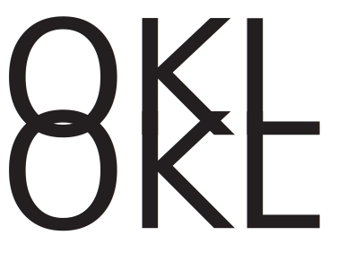

# Khai Ly O - Web Dev II - Portfolio

## Project Explanation
I started with the design I made in my UX Design class with Figma. For my project, I used Bootstrap to display my primary layout, grid layout, drop-down navigation bar, and Bootstrap color. I'm using AOS libraries to add transitions to my library to make it visually appealing. Because this is the first time I'm using Boostrap for the core layout of the site, I encountering challenges in making things responsive for a range of screen sizes. I'll have to use the dev tool to see what's messing with the Bootstrap grid and fix the problem. Working on this project helped me to work with Bootstrap effectively. 

### Challenges
- Using Bootstrap for the first time
- Using JS library for scroll
- Layout issues with the projects page
- making it responsive with variety screensize.

### Lessons Learned
- Using Bootstrap Grid effectively
- How to add libraries to your project
- Using Bootstrap to make responsive 

## Libraries Used
- [Bootstrap](https://getbootstrap.com/)
- [AnimateOnScroll](https://michalsnik.github.io/aos/)

## External Resources
- [Google Fonts] (https://fonts.google.com/)
- [Google Icon] (https://fonts.google.com/icons)
- [Font Awesome] (https://fontawesome.com/)
## Logo

